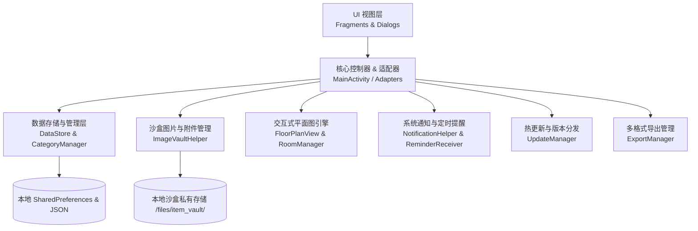

# 🏗️ 系统架构与模块设计文档 (ARCHITECTURE.md)

本文档阐述 **Collecter** 的技术架构、目录组织、核心模块及其交互流程。

---

## 1. 系统总体架构

---

## 2. 核心模块与职责划分

| 模块文件 | 职责说明 | 关键技术点 |
| :--- | :--- | :--- |
| `MainActivity.kt` | 主界面容器，负责底部导航切换、中央浮动记账按钮（FAB）、记账弹窗创建与系统图片选择器结果调度 | ActivityResultContracts, ViewBinding, Dialog |
| `HomeFragment.kt` | 首页仪表盘：总资产/日均消费统计看板、物品与订阅切换、在役/退役筛选、VIP 关注卡片与备份持久化提醒 | RecyclerView, MaterialCardView, Filter |
| `TimelineFragment.kt` | 「生活流」明细流水：按时间逆序展示出入库历史记录，支持快捷增删改 | Adapter, DateFormat |
| `ReportFragment.kt` | 「报表」统计中心：品牌价值排行 Top 5、分类支出色条占比、折旧费透视与历史收支汇总 | Custom Canvas 渲染, 折旧算法 |
| `ProfileFragment.kt` | 「我的」设置面板：分类管理、空间平面图配置、深浅主题切换、触感震动、每日提醒、备份导出与热更新 | MaterialSwitch, Dialog, Export |
| `DataStore.kt` | 数据访问对象（DAO），封装所有物品、空间房屋、分类、配置项的持久化与备份 JSON 生成 | SharedPreferences, JSON 序列化 |
| `DataModels.kt` | 核心数据实体定义：`Entry`、`HouseSpace`、`HouseRoom`、`LocationMovement`、`CustomCategory` | Kotlin Data Class |
| `ImageVaultHelper.kt` | 本地私有沙盒图片存储引擎：图片压缩、EXIF 角度纠偏、采样下采样与 LRU 内存双级缓存 | ExifInterface, LruCache, Bitmap |
| `FloorPlanView.kt` | 自定义 Canvas 平面图视图：支持空间网格绘制、房间触控拾取、图钉打点、脉冲高亮与在库物品数量徽章 | Custom View, Canvas, Touch Event |
| `FloorPlanDialog.kt` | 平面图交互弹窗：支持选点模式、全景房间浏览、房间资产抽屉列表与从物品一键穿梭定位 | ViewBinding, Material Dialog |
| `NotificationHelper.kt` | 系统定时提醒管理：订阅到期预警（提前 1~3 天）、VIP 物品核对打卡、保质期到期通知 | NotificationManager, AlarmManager |
| `ExportManager.kt` | 数据导出引擎：生成带 UTF-8 BOM 的 Excel 兼容 CSV 资产总表与流水表，支持系统级分享 | FileProvider, Intent.ACTION_SEND |
| `UpdateManager.kt` | GitHub Releases 在线热更新引擎：多镜像下载、后台静默预缓存与 0 秒秒级安装 | OkHttp-less HttpURLConnection, PackageInstaller |
| `ViewExt.kt` | UI 交互动效与触感震动扩展：按压回弹微缩放动效 (`applyPressScaleAnimation`) 与统一马达震动 (`performAppHapticFeedback`) | ObjectAnimator, HapticFeedbackConstants |

---

## 3. 关键交互流程

### 3.1 物品实物照片与凭证存储流程
1. 用户在添加/编辑界面点击「📷 实物照片」或「🧾 发票/保修卡」插槽。
2. 触发系统相册选择器（`ActivityResultContracts.GetContent`），获取图片 `Uri`。
3. `ImageVaultHelper.saveUriToVault` 读取流，解析 EXIF 旋转角，等比缩放至 1600px 限制以内，压缩为 JPEG 存入 `context.filesDir/item_vault/`。
4. 返回本地安全文件名，存入 `Entry.photoPath` 或 `Entry.receiptPath`。
5. 列表卡片异步通过 `ImageVaultHelper.loadSampledBitmap`（结合 LRU 缓存）秒级加载封面与缩略图。

### 3.2 空间平面图双向穿梭与寻物高亮流程
- **由物找空间**：
  1. 用户在首页卡片点击「📍 主卧 · 衣柜」标签。
  2. 调用 `FloorPlanDialog.show(..., targetEntry = entry)`。
  3. 平面图自动切换到对应所属空间（如「自己的家」）。
  4. 聚焦目标房间（高亮金色边框）并在坐标处绘制呼吸脉冲打点光晕（`Pulsing Pin`）。
  5. 底部同时展示该房间内存放的所有其他在库资产。
- **由空间看物品**：
  1. 用户在平面图全景浏览模式下点击任意房间。
  2. 平面图聚焦该房间，底部动态展开该房间资产抽屉，点击任意条目即可直接打开编辑。
