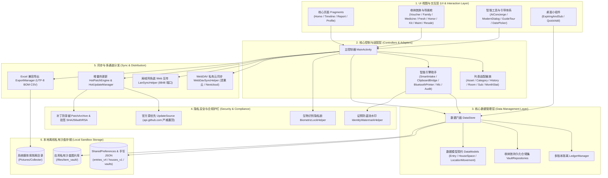

# 🏗️ 系统架构与模块设计文档 (ARCHITECTURE.md)

Stage 456：shared `FamilyEndpoint.kt` 校验家庭及 WebDAV 带凭据传输，HTTP 仅私有 IPv4/loopback/localhost，其他必须 HTTPS；Android 显式启用局域网明文，不代表全应用网络白名单。桌面失败导入仅回滚本次新附件，FamilyAccess 清理过期成员；`scripts/Archive-CollecterBackup.ps1` 提供手动离线归档。见 [456 报告](stages/stage-456-report.md)。

## Stage 455 工作台模块

- `WorkbenchRepository.kt`：Android 工作台原始 JSON 快照与单次 SharedPreferences 事务提交，保留多账本标识。
- `WorkbenchActivity.kt`：关键词/位置搜索、保存查询、批量整理、建议预览、关联与生命周期；加密备份、历史恢复及状态入口。
- `FamilyClientDialog.kt`：显式连接桌面家庭接口，成员密钥仅在当前会话使用；列表及位置修改，服务端裁决权限。
- shared `CollectionWorkbench.kt`：两端共用的无损命令、查重、查询和生命周期；`EncryptedBackup.kt`：AES-GCM 加密备份；`WebDavHistoryClient.kt`：只读历史下载。
- desktop `DesktopWorkbench.kt`：JVM 整理窗口与文件导入；`FamilyAccess.kt`：独立成员会话、逐条授权、角色与撤销；不替代 Native 安装交付。

saved_searches 加入已有备份/合并集合；生命周期、责任人和共享标记为记录扩展字段。成员密钥不写入业务 JSON 或备份；共享接口拒绝未授权集合、全量备份和敏感记录。

## 当前模块与 WebDAV 边界（2026-08-31）

Stage 454 增加 shared `WebDavRevisionGuard`，双端对有能力声明的服务采用 ETag 条件写入。相邻服务历史位于 DAV 挂载之外，覆盖/删除先归档，恢复通过历史下载与条件 PUT；客户端本地数据协议不变。OCR 通过 `WorkspaceRecords.ocrResult` 与仓储事务锁避免旧回调覆盖并发整理。限制与证据见 [454](stages/stage-454-report.md)。

`settings.gradle.kts` 注册 app、desktop、shared。离线存储仍在客户端，旁边 WebDav 项目是可选远端备份服务，不是中心数据库或新 Gradle 模块。`WebDavSyncHelper.kt` 的连接检查使用 HEAD，上传/下载使用 PUT/GET；`DesktopWebDavHelper.kt` 用 JDK HttpClient 发 PROPFIND，数据传输仍用 HttpURLConnection。两端同名文件 `Collecter_Backup.json`，恢复由共享校验与各端仓储执行。远端覆盖备份不等于 `SnapshotSync.kt` 的双向合并。源码与限制见 [使用说明](manuals/webdav-backup.md)，实际测试见 [联调报告](stages/webdav-integration-report.md)。

本文档阐述 **Collecter** 的技术架构、目录组织、核心模块及其交互流程。

---

## 1. 系统总体架构

---

## 2. 核心模块与职责划分

| 模块文件 | 职责说明 | 关键技术点 |
| :--- | :--- | :--- |
| `MainActivity.kt` | 主界面容器，负责底部导航切换、中央浮动记账按钮（FAB）、记账弹窗、扫码结果分发与生物识别生命周期拦截 | ActivityResultContracts, ViewBinding, BiometricPrompt |
| `HomeFragment.kt` | 首页仪表盘：总资产/日均消费统计看板、物品与订阅切换、在役/退役筛选、VIP 关注卡片、扫一扫与备份提醒 | RecyclerView, MaterialCardView, Filter |
| `TimelineFragment.kt` | 「生活流」明细流水：按时间逆序展示出入库历史记录，支持快捷增删改 | Adapter, DateFormat |
| `ReportFragment.kt` | 「报表」统计中心：资产分类交互式环形图 (`DonutChartView`)、闲置资产与断舍离健康雷达、品牌价值 Top 5 | Custom Canvas 渲染, 健康度评分算法 |
| `ProfileFragment.kt` | 「我的」设置面板：分类管理、空间平面图、深浅主题、触感震动、生物识别锁、WebDAV 云同步与 GitHub 热更新 | MaterialSwitch, WebDAV, Dialog |
| `DataStore.kt` | 数据访问对象（DAO），封装所有物品、空间房屋、分类、配置项的持久化与备份 JSON 生成，广播桌面小组件刷新 | SharedPreferences, JSON, AppWidgetBroadcast |
| `DataModels.kt` | 核心数据实体定义：`Entry`、`HouseSpace`、`HouseRoom`、`LocationMovement`、`CustomCategory` | Kotlin Data Class |
| `BoxQrCodeDialog.kt` | 智能收纳便签工坊：支持箱盒清单、食材保鲜、药箱对症、线缆规格、防丢联系 5 大多模态便签生成与 1080P 高清相册导出 | ZXing QRCodeWriter, Canvas, MediaStore, ViewBinding |
| `ScannerActivity.kt` | 智能扫码相机 Activity：基于 ZXing 离线识别收纳箱专属协议（`collecter://room?...`）与通用商品条码 | ZXing DecoratedBarcodeView |
| `DonutChartView.kt` | 资产分类占比交互式环形图：原生 Canvas 绘制空心环形图，平滑展开动效，触碰扇区高亮与中心总额联动 | Custom View, Canvas, ValueAnimator |
| `ExpiringAndSubWidgetProvider.kt` | 桌面小组件 1：临期保质期与周期订阅扣费倒计时小组件 | AppWidgetProvider, RemoteViews |
| `QuickAddWidgetProvider.kt` | 桌面小组件 2：在役资产净值/日均消费看板与一键记一笔小组件 | AppWidgetProvider, PendingIntent |
| `BiometricLockHelper.kt` | 生物识别隐私锁：调用系统原生指纹/面容/锁屏凭据认证，保护资产隐私 | BiometricPrompt, BiometricManager |
| `WebDavSyncHelper.kt` | WebDAV 私有云同步引擎：支持坚果云、Nextcloud、群晖 Synology，原生 HttpURLConnection 实现 | HTTP Basic Auth, PUT, GET, PROPFIND |
| `ImageVaultHelper.kt` | 本地私有沙盒图片存储引擎：图片压缩、EXIF 角度纠偏、采样下采样与 LRU 内存双级缓存 | ExifInterface, LruCache, Bitmap |
| `FloorPlanView.kt` | 自定义 Canvas 平面图视图：支持空间网格绘制、房间触控拾取、图钉打点、脉冲高亮与在库物品数量徽章 | Custom View, Canvas, Touch Event |
| `FloorPlanDialog.kt` | 空间平面图与箱盒 X 光透视舱：支持选点打点、全景房间浏览、微观资产估值与空间负荷透视、以及一键整箱跨房间批量搬家流转 | ViewBinding, Material Dialog, LocationMovement |
| `NotificationHelper.kt` | 系统定时提醒管理：订阅到期预警（提前 1~3 天）、VIP 物品核对打卡、保质期到期通知 | NotificationManager, AlarmManager |
| `ExportManager.kt` | 数据导出引擎：生成带 UTF-8 BOM 的 Excel 兼容 CSV 资产总表与流水表，支持系统级分享 | FileProvider, Intent.ACTION_SEND |
| `UpdateManager.kt` | GitHub Releases 在线热更新引擎：官方源优先的多通道下载、后台静默预缓存与 0 秒秒级安装 | HttpURLConnection, PackageInstaller, UpdateSource |
| `HotPatchEngine.kt` | 🔐 动态热补丁与沙盒资源加载引擎：补丁沙盒管理、崩溃熔断自动回滚；**动态 dex 必须通过 SHA256withRSA 验签才允许加载（fail-closed）** | DexClassLoader, Signature, PatchArchive |
| `HotUpdateManager.kt` | 热补丁检查与下载调度：解析 Release 资产中的 `*patch*.zip`、下载进度回调与应用落地 | HttpURLConnection, UpdateSource |
| `ViewExt.kt` | UI 交互动效与触感震动扩展：按压回弹微缩放动效 (`applyPressScaleAnimation`) 与统一马达震动 (`performAppHapticFeedback`) | ObjectAnimator, HapticFeedbackConstants |
| `UpdateSource.kt` | 🔐 更新下载源优先级统一策略：官方 GitHub 域名永远排在候选列表第一位，第三方 CDN 代理仅作容灾 fallback；非官方地址不转发给代理 | 安全不变量, 单元测试覆盖 |
| `PatchArchive.kt` | 🔐 补丁压缩包安全解压器（纯 JVM，可单元测试）：Zip Slip 路径穿越防护、条目数上限与解压体积上限（防 zip 炸弹） | ZipInputStream, canonicalPath 校验 |
| `VaultRepositories.kt` | 五大收纳馆（卡券 / 证照 / 药箱 / 生鲜 / 荣誉）的持久化仓储集，由 `DataStore` 门面持有并委托，存储 key 与 JSON 字段与拆分前完全一致 | SharedPreferences, JSON, Facade 模式 |
| `VoucherVaultDialog.kt` | 时效权益与卡券票据收纳馆：管理优惠券、代金券、次卡与会员权益，3天临期预警，次卡扣减打卡 | ViewBinding, MaterialCardView, Filter |
| `FamilyVaultDialog.kt` | 家庭多成员证照安全夹与保单契约：全家身份证、护照、户口本、保单与合同分类加密收纳，一键脱敏复制与到期换证/续费预警 | Canvas 水印导出, ClipboardManager, ViewBinding |
| `FamilyMedicineDialog.kt` | 家庭智能健康药箱：按病症分类对症秒查常备药、用法用量展示、开封倒计时打卡与过期严禁服用红牌预警 | ViewBinding, SharedPreferences, DateFormat |
| `FoodVaultDialog.kt` | 冰箱冷冻与食材生鲜鲜度库：四温区分区管理、开封保鲜倒计时、今晚清库存一键筛选与烹饪消耗打卡 | ViewBinding, SharedPreferences, DateFormat |
| `HonorVaultDialog.kt` | 全家成长履历与荣誉考级勋章馆：学历、考级认证、职业资格与比赛获奖归档，年审换证预警，1080P 人生高光足迹长卷导出 | Custom Canvas 渲染, FileProvider, ViewBinding |
| `DigitalAssetManagerDialog.kt` | 数字相册与电子资产专属展厅：照片相册回忆集、软件授权 Key、域名与数字资料包集中归档，3-2-1 备份状态追踪与 Key 一键复制 | ViewBinding, ClipboardManager |
| `SubscriptionManagerDialog.kt` | 会员订阅与周期服务专属录入：定制管理云存储、影音、AI 工具、商超生活等周期扣费服务，月化/年化支出核算与下次续费预警 | DatePickerDialog, ViewBinding, Entry 适配 |
| `KitManager.kt` | 场景化装备套装与出行归巢归位舱：6 大出行预设、去程装箱与返程离店双向清点、1080P 清单海报导出与到家一键物归原位路线图打卡 | Custom Canvas 渲染, SharedPreferences, ViewBinding, LocationMovement |
| `LifeCapsuleDialog.kt` | 物品时光胶囊与生活画册回忆录：为重要物品记录高光时刻、生活故事与真香评分，Canvas 绘制 1080P 拍立得画册海报 | Custom Canvas 渲染, FileProvider, ViewBinding |
| `LendingManagerDialog.kt` | 实物外借流转与智能借还催还凭证：外借去向追踪、归还倒计时、电子借条交接单与微信温馨催还海报生成 | Custom Canvas 渲染, FileProvider, ViewBinding |
| `AiConciergeHelper.kt` | AI 资产智能管家与空间收纳优化顾问：全屋空间负荷体检诊断、环境安全风险排查、自然语言离线语义寻物与多维资产穿透 | MaterialAlertDialogBuilder, DataStore, ViewBinding |
| `SmartIntakeHelper.kt` | AI 多模态免录与结构化解析引擎：购物小票/发票/包装盒拍照 OCR 识别与字段提取，自然语言一句话记账智能拆解 | ML Kit Text Recognition, 正则解析 |
| `ClipboardOrderBridge.kt` | 淘口令与电商分享链接剪贴板无感桥接：侦测淘宝/京东/拼多多商品分享文本，自动弹出卡片一键结构化快速入库 | ClipboardManager, SmartIntakeHelper |
| `TutorialDialog.kt` | 功能全景与图文使用教程：系统各模块图文说明、步骤导览、使用技巧与直达跟手演练入口 | RecyclerView, ViewBinding, TutorialItem |
| `InteractiveGuideTour.kt` | 交互式手把手引导演练：全局聚光灯高亮定位、沙盒演示数据注入与退出/结束时 100% 自动回滚安全清理 | GuideOverlayView, ViewTreeObserver, 沙盒回滚 |
| `GuideOverlayView.kt` | 教程聚光灯遮罩视图：自定义绘制全屏半透明遮罩与目标 View 圆角镂空高亮区，呼吸动效与点击穿透拦截 | Custom View, Canvas PorterDuffXfermode, ValueAnimator |
| `LedgerManager.kt` | 多账本与独立资产空间管理：个人/家庭/工作室多套独立账本增删改与数据空间隔离切换 | SharedPreferences, JSON, DataStore 桥接 |
| `LanSyncHelper.kt` | 局域网大屏互传与 Web 控制台：基于内置轻量 HTTP 服务器实现同一 Wi-Fi 下免装客户端 Web 浏览与数据极速互传 | ServerSocket, Socket, JSON |
| `NfcHelper.kt` | NFC 碰一碰智能感应识物：读取/写入 NDEF 智能标签，贴碰即刻唤起物品卡片或定位空间 | NfcAdapter, NdefMessage, NdefRecord |
| `BluetoothPrinterHelper.kt` | 蓝牙便携热敏标签机直连打印引擎：基于 ESC/POS 指令集蓝牙配对直连，支持 5 大多模态收纳便签与二维码实体不干胶快速直印 | BluetoothSocket, ESC/POS, Bitmap 栅格化 |
| `InventoryAuditDialog.kt` | 全屋空间智能盘点助手：按房间/收纳箱逐项扫码核对在库状态，生成盘点差异报告与快速修正 | ViewBinding, ScannerActivity 联动 |
| `LocationHistoryDialog.kt` | 物品位置变动历史轨迹：时间轴展示物品在各个房间/收纳箱之间的挪动流转记录与操作备注 | RecyclerView, LocationMovement, ViewBinding |
| `RoomManagerDialog.kt` | 空间房间与收纳区域管理器：多房间增删改、平面图坐标绑定与各区域在库物品统计看板 | ViewBinding, HouseRoom, Custom Dialog |
| `CategoryManagerDialog.kt` | 资产分类管理器：系统内置与自定义分类增删改、默认分类图标与分类排序维护 | RecyclerView, SharedPreferences, Custom Dialog |
| `ResaleCopilotHelper.kt` | 闲置断舍离与回血决策舱：沉睡闲置资产智能雷达大盘、AI 闲鱼/转转高转化营销文案生成与一键转卖/赠送/回收出清流转 | ClipboardManager, MaterialCardView, ViewBinding |
| `MaintenanceManagerDialog.kt` | 全家耐用资产维保与年检日历舱：净水器、空调、私家车等设备三色维保大盘、常用维保模板预设与一键维保打卡自动排期推算 | MaterialCardView, DatePickerDialog, DataStore 适配 |
| `AssetAdapter.kt` | 主页与资产列表核心卡片 RecyclerView 适配器：支持在役/退役/折旧/时效多态状态、缩略图/凭证徽章、位置导航与时光胶囊快捷回调 | RecyclerView.Adapter, ItemAssetCardBinding, ViewExt |
| `CategoryAdapter.kt` | 资产分类树状分组与品牌汇总列表适配器：分类 Header 与品牌 Item 双 viewType 渲染、分类总件数与总金额统计及占比进度条展示 | RecyclerView.Adapter, 多 viewType, CategoryGroup, BrandSummary |
| `CategoryManageAdapter.kt` | 自定义资产分类管理列表适配器：预设分类与自定义分类标识、分类上移/下移排序与删除回调 | RecyclerView.Adapter, ItemManageCategoryBinding, DataStore |
| `HistoryAdapter.kt` | 资产历史出入库流水台账适配器：出入库类型色标、退役/订阅标签、单价/总额格式化与编辑/删除上下文操作 | RecyclerView.Adapter, RowHistoryBinding, Entry |
| `HotUpdateDialog.kt` | 类游戏沉浸式增量热补丁对话框：展示基础版本向目标补丁版本的流转动画、增量包大小、更新日志与动态加载进度条 | MaterialAlertDialogBuilder, DialogHotUpdateBinding, HotUpdateManager |
| `IdentityWatermarkHelper.kt` | 家庭证照安全防盗流水印压印引擎：纯本地离线为证件正反面扫描件绘制 45° 倾斜防盗流水印，防止网络外传挪用 | Canvas, Paint, 45° 旋转矩阵, Bitmap 离线合成 |
| `LendingVoucherGenerator.kt` | 实物外借交接凭证与微信催还海报生成引擎：原生 Canvas 离线绘制 1080P 高清交接单，包含借用人、归还日、押金凭据与配件明细 | Canvas, Bitmap, Scoped Storage (Pictures/Collecter) |
| `LifeCapsulePosterGenerator.kt` | 物品时光胶囊与生活画册回忆录海报生成引擎：原生 Canvas 绘制 1080P 拍立得/生活杂志风长图画册，串联里程碑故事与生活真香评分 | Canvas, StaticLayout, TextPaint, 动态长图高度测算 |
| `ModernDatePickerDialog.kt` | 现代化全景日期选择器：支持 1980~2035 跨年代网格直达、常用快捷时间标签（今天/昨天/1年前/3年前）与相对天数实时动态计算 | GridLayout, Calendar, MaterialAlertDialogBuilder, ViewExt |
| `ModernDialogHelper.kt` | 全局统一现代化高定弹窗组件工厂：统一 26dp 双层质感卡片、单选列表、多选列表、输入框与确认/危险操作弹窗 | AlertDialog, MaterialCardView, DialogModernBaseBinding |
| `MonthStatAdapter.kt` | 按月出入库财务收支统计列表适配器：月度入库件数/金额、出库件数与净变动统计卡片渲染 | RecyclerView.Adapter, ItemMonthStatBinding, MonthStat |
| `PhotoPreviewDialog.kt` | 沉浸式实物照片与购买发票大图预览弹窗：1200x1200 高清降采样加载、双层圆角卡片、标题与系统分享面板调用 | ImageVaultHelper, FileProvider, MaterialAlertDialogBuilder |
| `ReminderReceiver.kt` | 定时提醒与开机自启广播接收器：监听系统 BOOT_COMPLETED 与自定义定时闹钟广播，触发资产到期与维保核验推送 | BroadcastReceiver, AlarmManager, NotificationHelper |
| `RoomManageAdapter.kt` | 空间房间与收纳区域管理列表适配器：房间图标/背景色渲染、物品总数统计、房间上移/下移排序与编辑/删除 | RecyclerView.Adapter, ItemManageRoomBinding, HouseRoom |
| `SubscriptionAdapter.kt` | 周期性订阅服务列表适配器：订阅周期徽章（按月/按年/自动续费）、下次扣费日倒计时、月化单价与更多操作菜单 | RecyclerView.Adapter, ItemSubCardBinding, Entry 周期计算 |
| `SettingsStore.kt` | 系统通用配置持久化仓储：深浅主题、通知提醒、触感震动、生物锁、WebDAV 云凭据、备份提醒与简易模式持久化 | SharedPreferences, DataStore 委托 |
| `SpaceRepository.kt` | 多空间与房屋房间持久化仓储：多套家庭空间房屋与房间增删改查、平面图布局与坐标映射持久化 | SharedPreferences, JSON, DataStore 委托 |
| `CategoryRepository.kt` | 资产分类与预设分组持久化仓储：物品分类增删改、预设分类与已有物品分类动态合并计算 | SharedPreferences, JSON, DataStore 委托 |
| `BackupCodec.kt` | 全量资产备份编解码器：全量分类与物品数据 JSON 序列化导出与安全校验导入 | JSON, Backup, DataStore 委托 |
| `AnalyticsQueries.kt` | 资产统计分析与智能查询引擎：闲置变现回血 ROI 统计、耗材安全库存预警与智能采购清单文本生成 | 数据分析, 智能采购清单, DataStore 委托 |
| `EntryRepository.kt` | 物品资产核心持久化仓储：出入库记录、折旧、退役待办、时光回忆与借还台账底层持久化 | SharedPreferences, JSON, DataStore 委托 |
| `AddEntryDialog.kt` | 资产出入库与编辑弹窗控制器：物品出入库、折旧、保质期、AI 识物/记账、空间图钉映射与实物照片发票存管 | DialogAddEntryBinding, MaterialAlertDialogBuilder, SmartIntakeHelper |
| `TourSandbox.kt` | 引导教学演示数据沙盒管理器：演练数据标记与完成/退出时 100% 自动回滚清理 | Sandbox, DataStore, InteractiveGuideTour |
| `SingleFeatureTours.kt` | 28 个单项功能手把手跟手演练分发器：各功能独立聚光灯、演示沙盒与演练入口调用 | GuideOverlayView, TourSandbox, InteractiveGuideTour 委托 |
| `VaultUiHelper.kt` | 收纳馆统一 UI 辅助基建：统一 8 大收纳馆的视窗动效、剪贴板复制、日期选择器与搜索监听 | Dialog, DatePickerDialog, ClipboardManager, TextWatcher |
| `WardrobeVaultDialog.kt` | 换季衣橱与四季穿搭舱控制器：四季胶囊衣橱分舱、真空压缩袋与顶柜收纳定位、穿着打卡、次均穿戴成本精算与 180 天沉睡未穿预警 | DialogWardrobeVaultBinding, VaultUiHelper, WardrobeAdapter, DataStore |
| `WardrobeAdapter.kt` | 换季衣橱与四季穿搭列表适配器：服饰单品卡片渲染、季节/材质/收纳位展示、穿着打卡与封箱解封操作分发 | ItemWardrobeRecordBinding, WardrobeRecord, RecyclerView.Adapter |
| `EmergencyVaultDialog.kt` | 家庭应急防灾与生命线舱控制器：四大避难专包归集、物资保质期/自放电测试/滤毒失效生命线追踪与季度点检打卡 | DialogEmergencyVaultBinding, VaultUiHelper, EmergencyAdapter, DataStore |
| `EmergencyAdapter.kt` | 家庭应急防灾物资列表适配器：应急专包/分类徽章、黄金动线位置展示、失效预警与点检打卡分发 | ItemEmergencyRecordBinding, EmergencyItem, RecyclerView.Adapter |
| `UniversalVaultCenterDialog.kt` | 全维度收纳总厅与生命线总控看板控制器：12大专业收纳馆聚合直通、全景临期与失效红绿灯雷达与收纳健康度评分 (100分制) | DialogUniversalVaultCenterBinding, VaultUiHelper, MaterialAlertDialogBuilder, DataStore |
| `ToolMaintenanceDialog.kt` | 家庭工具五金与设备维保舱控制器：电动/手工工具分类、螺丝钻头搭配速查、净水新风等设备耗材周期维保排期与一键打卡 | DialogToolVaultBinding, VaultUiHelper, ToolMaintenanceAdapter, DataStore |
| `ToolMaintenanceAdapter.kt` | 家庭工具五金与设备维保列表适配器：分类徽章、规格型号/钻头展示、逾期预警与维保打卡分发 | ItemToolRecordBinding, ToolMaintenanceRecord, RecyclerView.Adapter |
| `PlantCareDialog.kt` | 家庭绿植花卉与水肥养护舱控制器：光照习性档案、浇水施肥倒计时排期、逾期预警与一键养护打卡 | DialogPlantVaultBinding, VaultUiHelper, PlantCareAdapter, DataStore |
| `PlantCareAdapter.kt` | 家庭绿植花卉与水肥养护列表适配器：光照徽章、排期展示、缺水/需肥角标与浇水施肥操作分发 | ItemPlantRecordBinding, PlantCareRecord, RecyclerView.Adapter |
| `PetCareDialog.kt` | 家庭萌宠档案与健康耗材舱控制器：物种档案、体重与芯片号脱敏速查、驱虫与疫苗倒计时排期与一键打卡 | DialogPetVaultBinding, VaultUiHelper, PetCareAdapter, DataStore |
| `PetCareAdapter.kt` | 家庭萌宠档案与健康耗材列表适配器：物种/体重徽章、芯片号复制、待驱虫/待打疫苗角标与打卡操作分发 | ItemPetRecordBinding, PetCareRecord, RecyclerView.Adapter |
| `BookVaultDialog.kt` | 书房藏书与阅读收纳舱控制器：藏书空间定位、阅读进度追踪打卡、外借流转与书摘评分 | DialogBookVaultBinding, VaultUiHelper, BookVaultAdapter, DataStore |
| `BookVaultAdapter.kt` | 书房藏书与阅读收纳列表适配器：分类/评分徽章、进度条渲染、外借详情与进度打卡/外借操作分发 | ItemBookRecordBinding, BookRecord, RecyclerView.Adapter |
| `BeverageTeaDialog.kt` | 茶窖珍藏与适饮时效舱控制器：名茶名酒存藏定位、陈化年份精算、适饮黄金峰值期、开瓶保鲜与库存打卡 | DialogBeverageVaultBinding, VaultUiHelper, BeverageTeaAdapter, DataStore |
| `BeverageTeaAdapter.kt` | 茶窖珍藏与适饮时效列表适配器：分类/陈化徽章、适饮/超期状态展示、开瓶保鲜信息与开瓶/消耗打卡分发 | ItemBeverageRecordBinding, BeverageTeaRecord, RecyclerView.Adapter |
| `VaultAlertAggregator.kt` | 12 馆综合时效预警统一聚合器：按紧急天数排序聚合全馆临期卡券、过期药品、生鲜鲜度、绿植水肥、萌宠疫苗等时效事项 | 跨馆数据聚合, 纯 JVM, 单元测试复用 |
| `VaultAlertWidgetProvider.kt` | 桌面小组件 3：12 馆综合时效预警 2×2 小组件，实时同步显示前 4 条最紧迫待办并一键直达主 App | AppWidgetProvider, RemoteViews, PendingIntent |
| `GlobalSearchDialog.kt` | 全库与 12 馆跨维极速联合检索对话框：毫秒级穿透资产主库与全部 12 个收纳馆，支持分类卡片展示与主库联动筛选 | MaterialAlertDialogBuilder, DataStore, ViewExt |
| `StorageCleanupDialog.kt` | 图片沙盒孤立文件清理与批量重压缩工具：扫描未引用废弃图片一键清理，多线程无损重压缩减重 15%~20% 释放存储 | ImageVaultHelper, BitmapFactory, ThreadPool |
| `LanShareServer.kt` | 局域网 HTTP 互传服务器 (Port 8848)：同一 Wi-Fi 免装客户端网页大屏查看与 JSON 备份极速下载 | ServerSocket, Socket, HTTP 1.1 |
| `LanPeerDiscovery.kt` | 局域网设备自发现引擎 (UDP Port 8849)：同一 Wi-Fi 下自动广播与监听，秒级探测在线手机端与桌面端设备 | DatagramSocket, UDP 广播, 线程池 |
| `LanSyncMergeEngine.kt` | 局域网 P2P 双机增量对撞合并引擎：唯一 ID 寻址、时间戳 Last-Write-Wins 冲突仲裁与 12 馆全量物资无损互通 | JSON 对撞合并, 时间戳仲裁, 结构化 MergeReport |
| `IdeaVaultDialog.kt` | 闪念灵感与想法收纳舱控制器：0.5秒极速记录生活灵感、读书心得与随手便签，多色卡片流、置顶与跨维实体关联 | MaterialCardView, GradientDrawable, DataStore 委托 |
| `ClippingVaultDialog.kt` | 智能剪藏与文章知识舱控制器：截图OCR索引提取、网络文章深度剪藏与离线纯净 Markdown 沉浸式阅读器 | MaterialAlertDialogBuilder, OCR 预览, DataStore 委托 |
| `ScreenshotOcrProcessor.kt` | 截图离线 OCR 提取与智能打标引擎：纯本地端侧 ML Kit 提取截图文字、智能分析电商/技术/食谱标签并自动入库 | ML Kit Text Recognition, 线程池, DataStore |
| `ScreenshotWatcherHelper.kt` | 系统截图无感监听器：注册 ContentObserver 自动捕获系统截屏并去重，无缝唤醒离线 OCR 归档处理 | ContentObserver, MediaStore, 幂等去重 |
| `WebClipperEngine.kt` | 网页与社交文章深度剪藏引擎：纯净提取微信/知乎/掘金/小红书正文，剔除杂质自动转为离线 Markdown 快照 | HttpURLConnection, 正则解析, Markdown 生成 |

## Stage 453 新增模块

| 文件 | 职责 |
| --- | --- |
| `CompleteBackupStore.kt` | 全集合附件备份、导入预检、三套偏好事务日志与中断恢复 |
| `JsonCollectionWriter.kt` | 保留未知字段，统一编辑版本及删除标记 |
| `CollectionWorkspace.kt` | 收集箱、双向关联与提醒的持久化入口 |
| `CollectionWorkspaceDialog.kt` | 收集、找回、关联、OCR 重试、提醒处理界面 |
| `CollectShareActivity.kt` | Android 分享文字与照片，先保存原件 |

共享模块 `shared`：`BackupDocument.kt` 管理 JSON/附件边界；`WireAliases.kt` 统一两端历史字段；`SnapshotSync.kt` 实现合并；`LanHttp.kt` 处理鉴权和有界请求；`WorkspaceRecords.kt` 管理关联及提醒规则。
