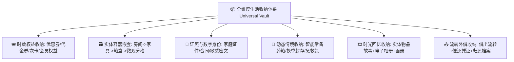

# 🧭 Collecter 系统演化偏好与决策总纲 (User Evolution Preferences & History)

> **核心铁律**：每次用户提到“演化”、“演化建议”或“系统进化”时，**必须首先读取并严格遵循本文件**中记载的用户核心喜好、审美偏好与被否决的负向清单，绝不重复提出已被否决的乏味方向！

---

## ⚡ 开发者全局铁律 (Global Development Ironclad Rules)

> **用户核心指令 (2026-08-20 强化指令)**：
> 1. **全景教程绝对同步**：以后**所有新增的功能都必须在「功能全景与使用教程」(`TutorialDialog.kt`) 中有详尽图文说明**；
> 2. **手把手跟手演练**：所有功能点都必须在 `InteractiveGuideTour.kt` 中提供**跟手步骤教程与互动导览**，中途随时支持点击退出；
> 3. **复杂演练沙盒示例与自动回滚清理**：对于逻辑复杂的教程，**可以引导用户填写示例或注入演示数据，但教程结束或中途退出时，必须将这些演示示例原封不动地全部安全删除，绝对不污染和影响用户的真实数据**！
> 4. **全平台交付与 Release**：每次功能演化任务完成后，必须通过全平台编译测试、打包 5 大分发包并发布 GitHub Release。

---

## 🧠 第一性原理收纳架构总纲 (First-Principles Storage Philosophy)

> **用户核心定义**：
> **“核心是收纳。但是收纳可以大到实物，电子相片，会过期的优惠券，会过期的会员订阅等等。并且在使用它的过程中会演化出不同场景需求，你需要用第一性原理拆开解决。”**

---

## 💎 用户核心喜好与历史认可方向 (Liked & Appreciated)

1. **第一性原理全维度收纳（高度认可 🌟🌟🌟🌟🌟）**：
   - 涵盖实物、数字相册、时效优惠券、会员订阅、重要证照、药箱与微观箱盒等全场景。
2. **时效权益与卡券票据收纳馆 (v4.0.0 🌟🌟🌟🌟🌟)**：
   - 优惠券、代金券、洗车/健身次卡、会员每月专属权益统一归拢，3天临期强提醒，次卡一键扣减。
3. **家庭多成员证照安全夹 (v4.0.0 🌟🌟🌟🌟🌟)**：
   - 全家身份证、护照、户口本分类加密归档，证号一键脱敏复制，Canvas 倾斜防盗流水印导出。
4. **家庭智能健康药箱 (v4.0.0 🌟🌟🌟🌟🌟)**：
   - 对症速查、用法用量展示、开封倒计时打卡、过期药品红牌严禁服用预警。
5. **智能统一版本升级 (v4.0.0 🌟🌟🌟🌟🌟)**：
   - 单一入口，智能分流：优先免重装热补丁秒级生效，必要时全量 APK 升级。
6. **冰箱冷冻与食材生鲜鲜度库 (v4.1.0 🌟🌟🌟🌟🌟)**：
   - 划分冷冻/冷藏/干货调味分区，开封倒计时，临期3天琥珀色强预警，“今晚消灭/清库存”筛选，一键消耗打卡。
7. **全家成长履历与职业荣誉考级勋章馆 (v4.1.0 🌟🌟🌟🌟🌟)**：
   - 全家成员学历、职业资格、考级认证、比赛获奖归档，年审/换证提前预警，时间轴 Canvas 1080P 人生高光足迹长卷导出。
8. **物品生活时光胶囊与高质感生活画册（高度认可 🌟🌟🌟🌟🌟）**：
   - 记录生活故事、陪伴天数、日均成本、真香评分，原生 Canvas 离线绘制 1080P 高清画册海报。
9. **实物外借流转与智能借还追踪（高度认可 🌟🌟🌟🌟🌟）**：
   - 实物借出登记、借条凭证与微信温馨催还海报。

---

## 🚫 用户明确否决/不喜欢的负向清单 (Disliked & Rejected)

| 被否决方向 | 典型特征与被否决原因 |
| :--- | :--- |
| ❌ **复杂的外部智能家居/IoT 协议接入** | 脱离纯净离线资产管理主线，引入外部依赖与网络负担。 |
| ❌ **枯燥繁琐的纯售后/工单/电话簿** | 传统的售后保修卡包、网点电话拨号、工单流转等。 |
| ❌ **重度复杂的 3D CAD/网格化空间建模** | 繁琐的 3D 模型与空间渲染，过于冗余且不实用。 |
| ❌ **底层硬件极客体检** | 如 OTG 读写测速、SMART 硬盘体检、电池循环曲线等。 |
