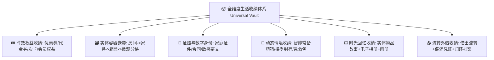

# 🧭 Collecter 系统演化偏好与决策总纲 (User Evolution Preferences & History)

> **核心铁律**：每次用户提到“演化”、“演化建议”或“系统进化”时，**必须首先读取并严格遵循本文件**中记载的用户核心喜好、审美偏好与被否决的负向清单，绝不重复提出已被否决的乏味方向！

---

## 🧠 第一性原理收纳总纲 (First-Principles Storage Philosophy)

> **用户核心定义**：
> **“核心是收纳。但是收纳可以大到实物，电子相片，会过期的优惠券，会过期的会员订阅等等。并且在使用它的过程中会演化出不同场景需求，你需要用第一性原理拆开解决。”**

### 什么是全维度“收纳”？
收纳的本质是**人对个人世界中所有「实物实体」、「数字信息」、「权益凭证」与「生活资产」的有序归拢、状态追踪、时效守护与场景化取用。**

---

## 💎 用户核心喜好与认可方向 (Liked & Appreciated)

1. **全维度收纳（第一性原理贯彻）**：
   - 涵盖实物、电子相册、时效优惠券、会员订阅、重要证照、药箱与微观箱盒等全场景。
2. **数字与实体双轨收纳（高度认可 🌟🌟🌟🌟🌟）**：
   - v3.6.0 数字相册与电子资产专属展厅。
3. **物品生活时光胶囊与高质感生活画册（高度认可 🌟🌟🌟🌟🌟）**：
   - 记录生活故事、陪伴天数、日均成本、真香评分，原生 Canvas 离线绘制 1080P 高清画册海报。
4. **实物外借流转与智能借还追踪（高度认可 🌟🌟🌟🌟🌟）**：
   - v3.7.0 实物借出登记、借条凭证与微信温馨催还海报。
5. **极简主义与克制设计**：
   - 支持简易模式、工具箱折叠收纳、极速热更新。
6. **交付铁律**：
   - 每次任务完成后必须执行全平台编译测试、打包 5 大分发包并发布 GitHub Release，并同步更新全景教学与跟手演练。

---

## 🚫 用户明确否决/不喜欢的负向清单 (Disliked & Rejected)

| 被否决方向 | 典型特征与被否决原因 |
| :--- | :--- |
| ❌ **复杂的外部智能家居/IoT 协议接入** | 脱离纯净离线资产管理主线，引入外部依赖与网络负担。 |
| ❌ **枯燥繁琐的纯售后/工单/电话簿** | 传统的售后保修卡包、网点电话拨号、工单流转等。 |
| ❌ **重度复杂的 3D CAD/网格化空间建模** | 繁琐的 3D 模型与空间渲染，过于冗余且不实用。 |
| ❌ **底层硬件极客体检** | 如 OTG 读写测速、SMART 硬盘体检、电池循环曲线等。 |
