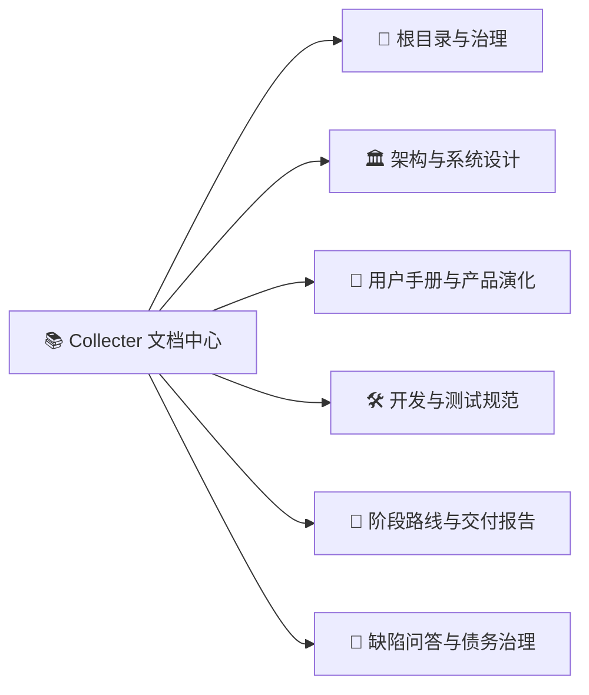

# Collecter 全景文档中心与阅读导航 (Documentation Index)

最新：Stage 457 源码整合、安全与 WebDAV 修复，见 [交付报告](stages/stage-457-report.md)。不创建新版本；远端新增模块保留，但不沿用“全部生产验收完成”的历史声明。

## 当前状态入口（2026-08-31）

- [v4.3.7 发布前检查](releases/v4.3.7-check.md)：线上最新已核实为 v4.3.6；发现发布分支安全和协议问题，尚未发布 4.3.7。

- [Stage 456 最新报告](stages/stage-456-report.md)、[原签名恢复](releases/signing-456.md)、[离线归档](manuals/backup-operations.md)、[隐私与重试设计](development/privacy-sync-plan-456.md)。签名已解决，完整验收仍未完成，未升版本或公开发布。

- [工作台使用说明](manuals/workbench.md)、[Stage 455 实现与验收](stages/stage-455-report.md)：收集/找回/生命周期、加密备份与家庭成员权限。

- [Stage 454 自主执行与最新验收](stages/stage-454-report.md)：备份历史/恢复、条件上传、OCR 并发保护和仍未关闭的交付项。

- [当前阶段](stage-current.md)与[待办](TODO.md)：代码存在、验证完成、发布阻塞分别记录。
- [WebDAV 操作与排错](manuals/webdav-backup.md)、[公网联调报告](stages/webdav-integration-report.md)。
- [本轮重新加载报告](stages/docs-refresh-20260831.md)、[Android 发布阻塞](releases/v4.3.3-report.md)。

欢迎查阅 **Collecter（记得住、找得到、不过期）** 的项目文档。
本文提供文档导航；历史报告保留当时结论，当前状态请以上方入口为准。

🌐 **[📦 点击打开全景功能能力地图与演化矩阵 (capability-map.html)](capability-map.html)**

---

## 🧭 全景文档图谱

---

### 1. 🧭 根目录与工程治理体系

| 文档名称 | 路径 | 核心内容说明 |
| :--- | :--- | :--- |
| **项目主入口** | [`../README.md`](../README.md) | 项目简介、全景特性一览、快速开始与构建指南 |
| **文档总目录** | [`README.md`](README.md) | 本文件：全量 51 篇文档总索引与角色指引 |
| **能力地图 (HTML)** | [`capability-map.html`](capability-map.html) | 可视化交互式能力地图、置灰演化路径与全量文档直达 |
| **Agent 启动协议** | [`../AGENTS.md`](../AGENTS.md) | Coding Agent 统一启动协议、六步顺序与不可违反红线 |
| **最高约束法则** | [`../GEMINI.md`](../GEMINI.md) | 最高执行约束、五条铁律与标准交付汇报规范 |
| **工程规范与门禁** | [`codex-skills.md`](codex-skills.md) | Token 策略、门禁测试要求与 Git 分支管理策略 |
| **当前阶段快照** | [`stage-current.md`](stage-current.md) | 当前 Stage 上下文快照与重点任务状态跟踪 |
| **待办执行账本** | [`TODO.md`](TODO.md) | 按 P0/P1/P2 优先级与责任人维护的执行账本 |
| **环境阻塞清单** | [`BLOCKERS.md`](BLOCKERS.md) | 外部依赖缺失、编译器环境与尚未解锁项跟踪 |
| **质量基准底线** | [`baseline.md`](baseline.md) | 单元测试指纹、覆盖率基准与安全不变量底线 |

---

### 2. 🏛️ 架构与系统设计 (`docs/design/` & `docs/`)

| 文档名称 | 路径 | 核心内容说明 |
| :--- | :--- | :--- |
| **业务需求与收纳哲学** | [`design/01-product-requirements.md`](design/01-product-requirements.md) | 第一性原理收纳分类体系与 12 大专业馆定位 |
| **系统总体架构设计** | [`design/02-system-architecture.md`](design/02-system-architecture.md) | 分层交互设计、无感感知层与离线私有沙盒 |
| **数据模型深度设计** | [`design/03-data-models-design.md`](design/03-data-models-design.md) | 4维物品体系、12馆实体与 JSON 协议契约 |
| **隐私安全与合规设计** | [`design/04-security-compliance-design.md`](design/04-security-compliance-design.md) | 私有沙盒存储、防盗流水印与生物识别锁规范 |
| **桌面单机版架构设计** | [`design/05-desktop-standalone-architecture.md`](design/05-desktop-standalone-architecture.md) | Native WebView2 壳、Ktor 引擎与独立数据隔离 |
| **系统架构精要** | [`ARCHITECTURE.md`](ARCHITECTURE.md) | 技术栈选型、架构层次与关键流程 |
| **全量数据契约总表** | [`DATA_MODELS.md`](DATA_MODELS.md) | 跨端共享的数据实体模型总览 |

---

### 3. 📖 用户手册与产品演化 (`docs/manuals/` & `docs/`)

| 文档名称 | 路径 | 核心内容说明 |
| :--- | :--- | :--- |
| **全功能权威使用手册** | [`manuals/20-user-guide.md`](manuals/20-user-guide.md) | 46 大功能特性操作步骤与高级技巧详解 |
| **全景手把手互动教学** | [`manuals/25-tutorial-dialog-guide.md`](manuals/25-tutorial-dialog-guide.md) | 新手图文教程与单项跟手演练系统指引 |
| **快速上手用户手册** | [`USER_MANUAL.md`](USER_MANUAL.md) | 核心功能快速查阅与常见操作 |
| **产品演化建议分析** | [`product-direction.md`](product-direction.md) | 需求第一性原理分析与未来阶段演化建议 |
| **演化偏好与负向清单** | [`EVOLUTION_PREFERENCES.md`](EVOLUTION_PREFERENCES.md) | 演进核心偏好与明确否决的负向禁令清单 |
| **AI 决策原理与逻辑** | [`GEMINI_RATIONALE.md`](GEMINI_RATIONALE.md) | AI 助手决策背景、思考链路与架构选择 |

---

### 4. 🛠️ 开发、测试与发布规程 (`docs/development/` & `docs/`)

| 文档名称 | 路径 | 核心内容说明 |
| :--- | :--- | :--- |
| **核心开发与编码规范** | [`development/11-development-guide.md`](development/11-development-guide.md) | 本地开发环境配置、Kotlin 编码准则与排错 |
| **测试计划与回归门禁** | [`development/12-test-plan.md`](development/12-test-plan.md) | 测试矩阵、门禁流水线与跨端兼容性验证 |
| **Spec 驱动开发指南** | [`development/33-spec-driven-development.md`](development/33-spec-driven-development.md) | SDD 强制规程：目标/边界/验证/完成标准 |
| **开发与维护指南** | [`DEVELOPMENT_GUIDE.md`](DEVELOPMENT_GUIDE.md) | Gradle 常用构建命令与日常维护备忘 |
| **发布流程与规范** | [`RELEASE_GUIDE.md`](RELEASE_GUIDE.md) | GitHub Releases 发版、签名与验签操作指南 |
| **版本更新日志** | [`CHANGELOG.md`](CHANGELOG.md) | 全量版本演进历史与更新记录 |

---

### 5. 🚀 阶段路线图与交付报告 (`docs/stages/` & `docs/releases/`)

| 文档名称 | 路径 | 核心内容说明 |
| :--- | :--- | :--- |
| **阶段演化全景路线图** | [`stages/stage-roadmap.md`](stages/stage-roadmap.md) | 阶段里程碑排期、演进规划与验收状态 |
| **Stage 450 交付报告** | [`stages/stage-450-idea-clipping-vault.md`](stages/stage-450-idea-clipping-vault.md) | 灵感想法舱与智能剪藏知识库底层基建 |
| **Stage 451 交付报告** | [`stages/stage-451-screenshot-watcher-clipper.md`](stages/stage-451-screenshot-watcher-clipper.md) | 系统截图无感监听器与 ML Kit 离线 OCR |
| **Stage 453 实施 Spec** | [`stages/stage-453-reliable-collection.md`](stages/stage-453-reliable-collection.md) | 可靠数据架构、统一收集箱与双端同步规约 |
| **Stage 453 交付报告** | [`stages/stage-453-delivery-report.md`](stages/stage-453-delivery-report.md) | 完整实施记录、73 项测试与门禁验证证据 |
| **Stage 453 真机冒烟记录** | [`stages/evidence-453/android-smoke-notes.md`](stages/evidence-453/android-smoke-notes.md) | Android 真机分享/OCR/关联/取消恢复实测 |
| **Stage 468 全局弹框视觉统一** | [`stages/stage-468-unified-dialog-design.md`](stages/stage-468-unified-dialog-design.md) | 全局 Material 弹框主题、圆角排版、优雅动效与模拟器视觉证据 |
| **Stage 440 桌面立项 Spec** | [`stages/stage-440-desktop.md`](stages/stage-440-desktop.md) | 桌面单机版 Native WebView2 独立立项报告 |
| **Stage 431 交付报告** | [`stages/stage-431.md`](stages/stage-431.md) | Stage 431 核心功能与修复记录 |
| **v4.3.2 发布说明** | [`releases/v4.3.2.md`](releases/v4.3.2.md) | v4.3.2 正式发布报告 |
| **v4.3.3 发布说明** | [`releases/v4.3.3.md`](releases/v4.3.3.md) | v4.3.3 候选发布说明 |
| **v4.3.3 发布 Spec** | [`releases/v4.3.3-spec.md`](releases/v4.3.3-spec.md) | v4.3.3 发版验证规格书 |
| **v4.3.3 实施报告** | [`releases/v4.3.3-report.md`](releases/v4.3.3-report.md) | v4.3.3 发版实施与签名状态报告 |

---

### 6. 🐞 缺陷问答与技术债务治理 (`docs/aq/`, `docs/bug/`, `docs/debt/`)

| 文档名称 | 路径 | 核心内容说明 |
| :--- | :--- | :--- |
| **架构问答知识库** | [`aq/aq.md`](aq/aq.md) | 架构问答、决策背景与真实代码映射 |
| **缺陷追踪账本** | [`bug/bugList.md`](bug/bugList.md) | Bug 唯一入口：现象、根因、修复方案与测试断言 |
| **技术债务体检总报告** | [`TECH_DEBT_AUDIT.md`](TECH_DEBT_AUDIT.md) | 代码质量、架构治理与规范执行体检清单 |
| **P0 级技术债务卡片** | [`debt/P0-1.md`](debt/P0-1.md) · [`debt/P0-2.md`](debt/P0-2.md) · [`debt/P0-3.md`](debt/P0-3.md) | 数据安全、空 catch 与关键门禁治理 |
| **P1 级技术债务卡片** | [`debt/P1-1.md`](debt/P1-1.md) · [`debt/P1-2.md`](debt/P1-2.md) · [`debt/P1-3.md`](debt/P1-3.md) | 双端同步一致性与多账本隔离治理 |
| **P2 级技术债务卡片** | [`debt/P2-1.md`](debt/P2-1.md) · [`debt/P2-2.md`](debt/P2-2.md) | 关联检索与提醒闭环治理 |
| **P3 级技术债务卡片** | [`debt/P3-1.md`](debt/P3-1.md) · [`debt/P3-2.md`](debt/P3-2.md) · [`debt/P3-3.md`](debt/P3-3.md) | 桌面端构建打包与跨平台生态治理 |

---

## 📖 读者与开发者指引

- **Coding Agent (AI 研发助手)**：
  - 启动第一步：读取 [`../AGENTS.md`](../AGENTS.md) 或 [`../GEMINI.md`](../GEMINI.md)；
  - 确定当前任务：读取 [`stage-current.md`](stage-current.md) 与 [`TODO.md`](TODO.md)；
  - 遵循工程约束：读取 [`codex-skills.md`](codex-skills.md)；
  - 交付前验证：执行 `pwsh .\tools\selfcheck.ps1`。
- **开发者 / 架构师**：
  - 了解系统设计：阅读 [`design/02-system-architecture.md`](design/02-system-architecture.md) 与 [`design/03-data-models-design.md`](design/03-data-models-design.md)；
  - 桌面单机版立项：阅读 [`design/05-desktop-standalone-architecture.md`](design/05-desktop-standalone-architecture.md)；
  - 编码规范：阅读 [`development/11-development-guide.md`](development/11-development-guide.md)。
- **终端用户 / 产品维护**：
  - 查阅所有功能：阅读 [`manuals/20-user-guide.md`](manuals/20-user-guide.md) 或打开 [`capability-map.html`](capability-map.html)。
