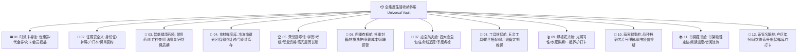

# 业务需求与第一性原理收纳体系 (Product Requirements & Storage Philosophy)

---

## 1. 产品定位与核心愿景

**Collecter** 是一款面向家庭与个人的**全维度资产、生命周期与收纳管理系统**。
核心理念：**“第一性原理全维度收纳”** —— 无论是有形实物、数字资产、即将失效的优惠券/会员订阅，还是证照契约、健康药箱、生鲜果蔬与书籍佳酿，均通过第一性原理进行场景化解构与全生命周期追踪。

---

## 2. 第一性原理收纳分类体系 (12 大专业收纳馆)

---

## 3. 演化偏好与负向禁令清单

### 3.1 核心偏好
- **离线安全优先**：业务数据 100% 存储于本地私有沙盒，无需中心化后端服务器。
- **全场景穿透**：空间平面图、Canvas 图钉打点、二维码便签、蓝牙打印与 NFC 碰一碰智能联动。
- **无感体验**：拍照 OCR 识别、剪贴板无感桥接、全库极速秒搜。

### 3.2 明确否决的负向清单 (Rejected)
- ❌ **复杂的外部智能家居/IoT 协议接入**：脱离纯净离线资产管理主线，引入外部网络负担。
- ❌ **枯燥繁琐的纯售后/工单/电话簿**：传统的售后保修卡包、网点拨号等。
- ❌ **重度复杂的 3D CAD/空间建模**：冗余繁琐且不实用。
- ❌ **底层硬件极客体检**：如 OTG 测速、SMART 硬盘测试等。
