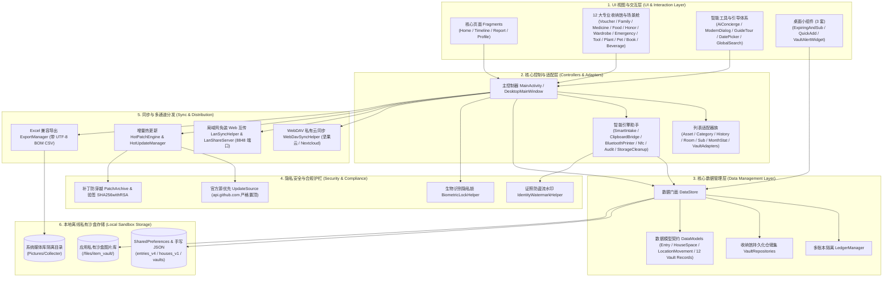

# 系统总体架构设计 (System Architecture)

---

## 1. 系统总体架构图

---

## 2. 模块层级划分说明

1. **UI 视图与交互层**：负责全景收纳卡片渲染、Canvas 图钉交互、自定义环形统计图、沉浸式弹窗与桌面小组件。
2. **控制器与适配层**：管理生命周期、分发业务事件、协调多模态输入（OCR / 剪贴板 / 蓝牙 / NFC）与数据流转。
3. **核心数据管理层**：通过门面模式（`DataStore`）统一纳管账本、主资产与 12 馆持久化仓储，负责 JSON 序列化与数据完整性校验。
4. **安全与合规护栏**：保障本地生物隐私、证件流水印、官方更新源优先级与动态补丁防投毒验签。
5. **同步与互传层**：提供 WebDAV 私有网盘备份、局域网免装大屏互传、UTF-8 BOM CSV 导出与热更新下载调度。
6. **离线沙盒存储层**：基于 SharedPreferences 和应用专属内部存储目录进行数据隔离，严格禁止明文网络上报。
