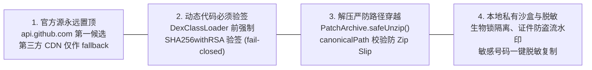

# 隐私安全与合规设计 (Security & Compliance)

> **最高原则**：App 里存储着用户全家的身份证、护照、房产证、保单、资产估值与加密凭证。安全性不可交换，慢是体验问题，投毒与泄露是毁灭性安全问题。

---

## 1. 四大不可协商的安全不变量

---

## 2. 详细安全机制与实现规范

### 2.1 官方更新源优先策略 (`UpdateSource.kt`)
- 候选列表中，官方源 `https://api.github.com` 与 `https://github.com` 必须永远排在第一位；
- 只有当官方源网络连接异常时，才允许降级使用第三方 CDN 代理源；
- 禁止将非官方下载链接或私有凭证转发至第三方镜像。

### 2.2 动态热补丁强签名校验 (`HotPatchEngine.kt`)
- 任何通过网络下载并由 `DexClassLoader` 加载的动态 DEX 补丁，必须使用预埋公钥通过 `SHA256withRSA` 进行完整性验签；
- 若无公钥配置或验签失败，系统执行 **fail-closed** 策略，直接拒绝加载并触发崩溃熔断回滚；
- **MD5/SHA1 是摘要指纹，绝不是数字签名**。

### 2.3 安全解压防穿越 (`PatchArchive.kt`)
- 严格遵循 `canonicalPath.startsWith(canonicalDestDir)` 检查；
- 限制单个补丁包内最大条目数（<= 1024）与最大展开体积（<= 50MB），严防 Zip Bomb（解压炸弹）。

### 2.4 证件安全与隐私防护 (`IdentityWatermarkHelper.kt`)
- 纯本地离线为证件正反面扫描件压印 45° 倾斜半透明防盗流水印；
- 身份证、护照、银行卡、芯片号在界面展示默认打码脱敏，防止屏幕窥探。
