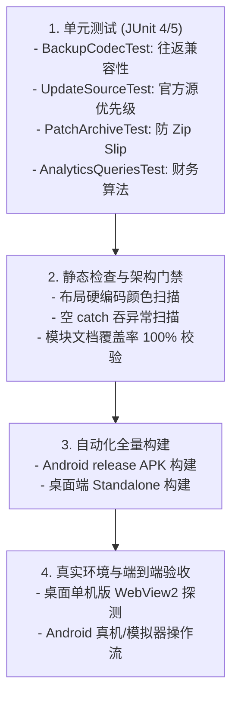

# 测试计划与持续集成门禁 (Test Plan & Verification)

---

## 1. 测试层级与覆盖范围



---

## 2. 交付前必跑自检指令

```powershell
pwsh -File .\tools\selfcheck.ps1
```

- **验证项**：
  1. `assembleRelease` 编译是否通过；
  2. `testReleaseUnitTest` 单元测试是否 100% 绿灯；
  3. 布局文件硬编码颜色检查（除相机取景框例外外 0 处）；
  4. 源码空 catch 扫描（0 处）；
  5. 版本号多处一致性校验；
  6. 系统核心模块文档记录覆盖率（100% 覆盖）。
- **指纹约束**：自检脚本自带 SHA 指纹防篡改机制，严禁修改测试断言或自检工具来伪造检查通过。
